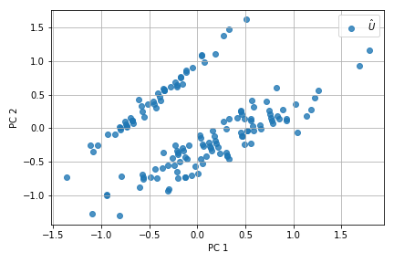
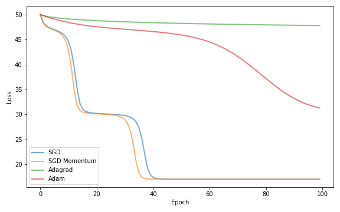
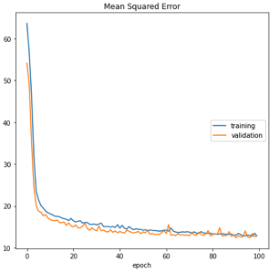
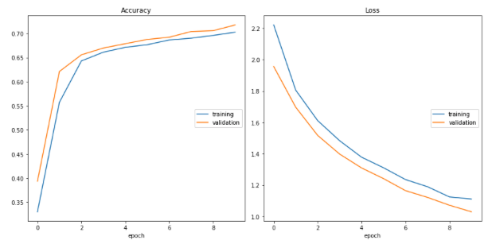
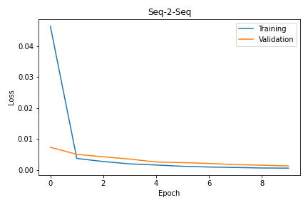
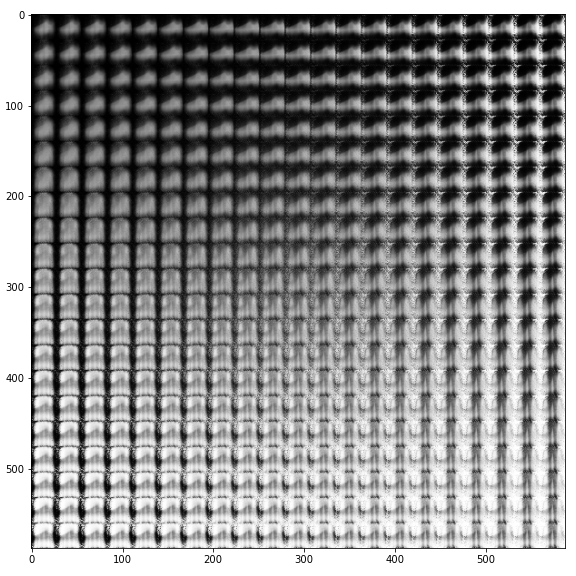

# deep-learning-soton
Deep Learning experiments.

## Contents

Principle Component Analysis with Singular Value Decomposition.

Comparing various optimisers.

Training a Convolutional Neural Network with Data Augmentation.

Transfer Learning with ResNet50.

Seq-2-Seq for Morse code translation.

Autoencoder latent space on FashionMNIST.

Variational Autoencoder latent space on Fashion MNIST.
